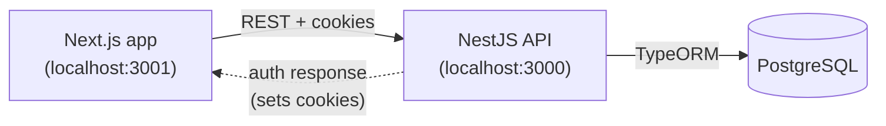
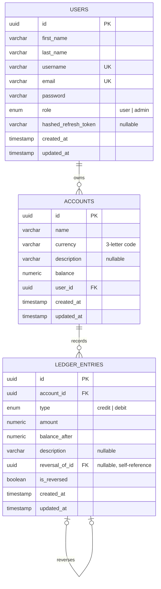

# Mini Transaction Ledger

A full-stack ledger application for managing accounts and recording
transactions. Users can create accounts, post credit/debit entries against
them, and review a running balance history. Administrators get a separate
view for managing all registered users.

The system is built around one non-negotiable rule: **posted transactions
are never edited or deleted**. Mistakes are corrected by posting an
offsetting reversal entry, so the transaction history always reflects
exactly what happened, in the order it happened.

## Table of contents

- [Tech stack](#tech-stack)
- [Project structure](#project-structure)
- [Setup and run instructions](#setup-and-run-instructions)
  - [Option A: Docker Compose](#option-a-docker-compose-recommended)
  - [Option B: Running locally without Docker](#option-b-running-locally-without-docker)
- [Architecture](#architecture)
- [Database schema](#database-schema)
- [How it works](#how-it-works)
  - [Authentication and sessions](#authentication-and-sessions)
  - [Roles and access control](#roles-and-access-control)
  - [Accounts and the ledger](#accounts-and-the-ledger)
  - [Frontend state management](#frontend-state-management)
- [API reference](#api-reference)

## Tech stack

**Backend**

- NestJS 11 (TypeScript)
- PostgreSQL with TypeORM
- Passport JWT (`passport-jwt`) with httpOnly cookie-based sessions
- class-validator / class-transformer for request validation and response
  serialization
- bcrypt for password hashing
- Joi for environment variable validation at startup

**Frontend**

- Next.js 16 (App Router, Turbopack)
- React 19 with TypeScript
- Tailwind CSS v4
- shadcn/ui components (built on `@base-ui/react`)
- Axios for HTTP requests

**Infrastructure**

- Docker Compose (PostgreSQL, backend, frontend)
- pnpm as the package manager for both apps

## Project structure

```
.
├── docker-compose.yml       # Postgres + backend + frontend, wired together
├── .env.example             # Environment variables consumed by docker-compose.yml
├── backend/                 # NestJS API
│   ├── src/
│   │   ├── auth/            # Signup, login, refresh, logout, guards, strategies
│   │   ├── users/            # User entity, roles, admin user management
│   │   ├── accounts/         # Ledger accounts (one-to-many with users)
│   │   ├── ledger/           # Append-only transaction entries and reversals
│   │   └── common/           # Shared transformers (e.g. decimal columns)
│   ├── Dockerfile
│   └── .env.example
└── frontend/                 # Next.js application
    ├── app/                   # Two routes: "/" (auth) and "/dashboard"
    ├── components/
    │   ├── auth/              # Login / signup forms
    │   ├── dashboard/         # Regular-user dashboard (accounts + ledger)
    │   └── admin/             # Admin dashboard (user management)
    ├── contexts/              # UserContext (the app's one React Context)
    ├── lib/api/               # One function per backend endpoint
    ├── Dockerfile
    └── .env.example
```

## Setup and run instructions

### Option A: Docker Compose (recommended)

This brings up PostgreSQL, the NestJS API, and the Next.js frontend together
with a single command. Requires only Docker and Docker Compose installed.

```bash
# 1. From the repository root, copy the example environment file
cp .env.example .env

# 2. Build and start all three services
docker compose up --build
```

Once the containers are up:

- Frontend: http://localhost:3001
- Backend API: http://localhost:3000
- PostgreSQL: localhost:5432 (credentials as set in `.env`)

The database schema is created automatically on first boot (TypeORM
`synchronize` is enabled for this project), so no separate migration step is
required.

To stop everything:

```bash
docker compose down
# add -v to also remove the Postgres data volume
```

### Option B: Running locally without Docker

Requires Node.js 20+, pnpm, and a running PostgreSQL instance.

**1. Database**

Create a PostgreSQL database and note its host, port, username, password,
and database name.

**2. Backend**

```bash
cd backend
cp .env.example .env
# edit .env with your database credentials and JWT secrets
pnpm install
pnpm start:dev
```

The API starts on `http://localhost:3000` (configurable via `PORT`).

**3. Frontend**

```bash
cd frontend
cp .env.example .env.local
# edit .env.local if the backend is not on http://localhost:3000
pnpm install
pnpm dev
```

The frontend starts on `http://localhost:3001`.

**4. Use the app**

Open `http://localhost:3001`, sign up for an account, and use the dashboard.
New signups are always created with the `user` role. To test the admin
dashboard, promote a user to `admin` directly in the database:

```sql
UPDATE users SET role = 'admin' WHERE email = 'you@example.com';
```

Then log out and log back in (or wait for the access token to refresh) so
the session picks up the new role.

## Architecture

The project is split into two independently deployable applications that
communicate over a REST API, plus a shared PostgreSQL database:



The browser talks directly to the backend over HTTP with credentials
(cookies) attached — there is no server-side proxy or backend-for-frontend
layer in the Next.js app. CORS on the NestJS side is restricted to the
configured `FRONTEND_URL`.

The backend is organized into four feature modules, each owning its own
entity, DTOs, service, and controller:

- **Auth** — signup, login, token refresh, logout. Depends on Users.
- **Users** — the `User` entity and role, admin-only user management.
- **Accounts** — ledger accounts, one-to-many with `User`.
- **Ledger** — transaction entries, one-to-many with `Account`.

## Database schema

Three tables. A user owns many accounts; an account owns many ledger
entries; a ledger entry may optionally point back at the entry it reverses.



Notes on constraints not visible in the diagram:

- `accounts.user_id` is `ON DELETE CASCADE` — deleting a user deletes their
  accounts, provided none of them have ledger history (see below).
- `ledger_entries.account_id` is `ON DELETE RESTRICT` — an account (or, by
  cascade, a user) cannot be deleted while it still has ledger entries. This
  is what turns "delete this account/user" into a `409 Conflict` instead of
  silently destroying transaction history.
- `ledger_entries.reversal_of_id` is a nullable self-reference: a reversal
  entry points at the entry it corrects, and the original is flagged
  `is_reversed = true`. Neither row is ever updated or deleted afterwards.

## How it works

### Authentication and sessions

Authentication uses two JWTs, both delivered as httpOnly cookies (never
exposed to client-side JavaScript, and never sent as an `Authorization`
header):

- **Access token** (15 minutes) — carries the user's id, email, and role.
  Required on every protected request.
- **Refresh token** (7 days) — used only to obtain a new access token. Its
  hash (SHA-256, not bcrypt — a JWT's shared header/subject prefix would
  otherwise collide under bcrypt's 72-byte input limit) is stored on the
  user record so a stolen or reused refresh token can be detected and the
  session revoked.

Because the access token's role claim is only as fresh as the moment it was
issued, the frontend's Axios instance (`lib/api-client.ts`) carries a
response interceptor: any `401`/`403` (other than from the auth endpoints
themselves) triggers one call to `POST /auth/refresh`, and the original
request is retried once with the new token. This keeps a long-lived tab
correctly in sync if a user's role changes mid-session, without forcing a
manual re-login.

### Roles and access control

There are two roles, `user` and `admin`, enforced with a `RolesGuard` plus a
`@Roles()` decorator on admin-only endpoints (for example, listing every
user, or deleting one). Endpoints that operate on a specific resource (a
user's own profile, or one of their accounts) additionally check ownership
in the controller, so a regular user can only ever read or modify their own
data, regardless of what role guard is applied.

### Accounts and the ledger

Each `User` can own multiple `Account` records (name, currency, optional
description, and a running `balance`). Each `Account` owns a sequence of
append-only `LedgerEntry` rows.

Posting a transaction (`POST /accounts/:accountId/entries`) is done inside a
single database transaction with a pessimistic row lock on the account, so
two concurrent transactions against the same account can never read a stale
balance and compute conflicting results. Every entry stores the account's
`balanceAfter` at the moment it was posted, giving a full audit trail
independent of the current balance.

Because ledger entries model real financial events, they are never updated
or deleted once posted — only their `description` can be edited afterwards.
Mistakes are corrected by posting a **reversal**: a new entry of the
opposite type for the same amount, linked back to the original via
`reversalOfId`, with the original flagged `isReversed`. This keeps the
ledger's history permanent while still letting a user correct a mistake.

This is also enforced at the database level: the foreign key from
`ledger_entries` to `accounts` uses `ON DELETE RESTRICT`, so an account (or
a user who owns one) cannot be deleted while it still has transaction
history — the API surfaces this as a `409 Conflict` rather than a raw
database error.

### Frontend state management

The frontend uses exactly one React Context (`UserContext`), holding the
current session's user and a `logout` function. Everything else follows a
"lift state up to the nearest common ancestor" approach:

- `UserDashboardView` owns the accounts list and the currently selected
  account; it hands read-only data and callbacks down to its children.
- `AccountDetails` is remounted (via a `key` on the account id) whenever the
  selected account changes, so its own transaction list resets for free
  instead of needing manual synchronization.
- `AdminDashboardView` owns the users list for the admin-only view.

Every backend endpoint has a corresponding, named function in `lib/api/`
(for example `createEntry`, `reverseEntry`, `updateUserRole`), built on a
small shared Axios wrapper that normalizes backend error responses into a
single `ApiError` type.

## API reference

All responses are wrapped as `{ message, data }` on success. Endpoints
marked **Admin** require the `admin` role; endpoints marked **Owner** allow
either the resource's owner or an admin.

### Auth (`/auth`)

| Method | Path             | Description                                    |
| ------ | ---------------- | ----------------------------------------------- |
| POST   | `/auth/signup`    | Register a new user (always created as `user`) |
| POST   | `/auth/login`     | Log in with email and password                 |
| POST   | `/auth/refresh`   | Exchange a valid refresh token for a new pair   |
| POST   | `/auth/logout`    | Revoke the current refresh token                |
| GET    | `/auth/me`        | Get the current session's full user record      |

### Users (`/users`)

| Method | Path         | Access | Description                          |
| ------ | ------------ | ------ | ------------------------------------- |
| POST   | `/users`      | Admin  | Create a user directly                |
| GET    | `/users`      | Admin  | List all users                        |
| GET    | `/users/:id`  | Owner  | Get a single user                     |
| PATCH  | `/users/:id`  | Owner  | Update a user (role changes: Admin only) |
| DELETE | `/users/:id`  | Admin  | Delete a user (fails if their accounts have ledger entries) |

### Accounts (`/accounts`)

| Method | Path            | Access | Description                              |
| ------ | --------------- | ------ | ------------------------------------------ |
| POST   | `/accounts`      | User   | Create an account for the current user   |
| GET    | `/accounts`      | User   | List accounts (own for `user`, all for `admin`) |
| GET    | `/accounts/:id`  | Owner  | Get a single account                     |
| PATCH  | `/accounts/:id`  | Owner  | Update name / description                |
| DELETE | `/accounts/:id`  | Owner  | Delete an account (fails if it has ledger entries) |

### Ledger entries (`/accounts/:accountId/entries`)

| Method | Path                      | Access | Description                          |
| ------ | ------------------------- | ------ | ------------------------------------- |
| POST   | `/entries`                 | Owner  | Post a credit or debit entry         |
| GET    | `/entries`                 | Owner  | List entries for the account         |
| GET    | `/entries/:entryId`        | Owner  | Get a single entry                   |
| PATCH  | `/entries/:entryId`        | Owner  | Update an entry's description only   |
| POST   | `/entries/:entryId/reverse`| Owner  | Post a reversal of an existing entry |
